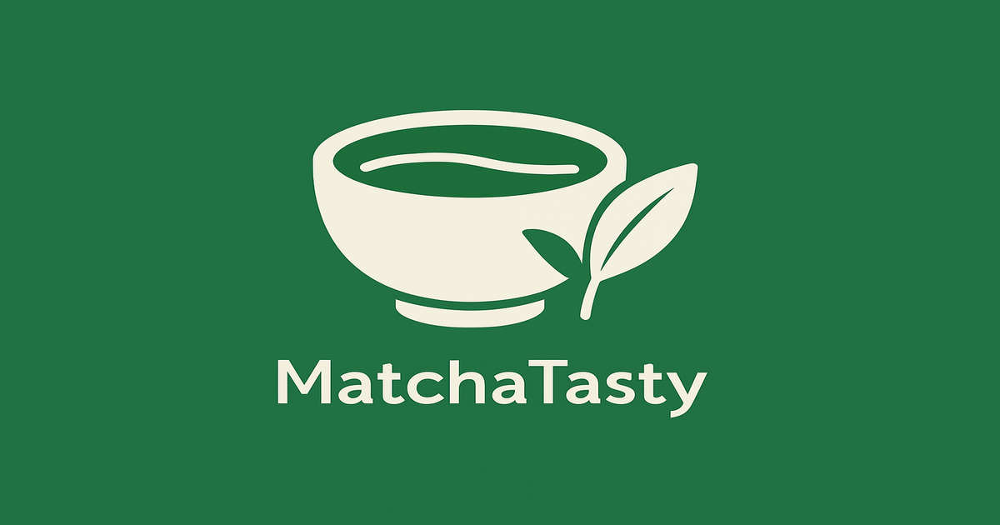

# MatchaTasty 🍵

抹茶スイーツ特化型レビュー・発見サービス

**サービスURL**: https://matchatasty.com

---

## 目次

- [サービス概要](#-サービス概要)
- [開発背景](#-開発背景)
- [主要機能](#-主要機能)
- [サービスの差別化ポイント](#-サービスの差別化ポイント)
- [使用技術](#-使用技術)
- [技術選定理由](#-技術選定理由)
- [こだわった実装](#-こだわった実装)
- [ER図](#er図)
- [画面遷移図](#画面遷移図)

---

## 🍵 サービス概要

**MatchaTasty**は、抹茶スイーツに特化したレビュー・発見サービスです。

抹茶の濃さ・苦味・甘さなど、抹茶特有の評価軸を設けることで、ユーザーが自分好みの抹茶スイーツを正確に見つけられます。従来のグルメサイトでは分からない「本当の抹茶の濃さ」を可視化し、抹茶スイーツ選びの失敗をなくします。

### 主な特徴

- 🔍 **抹茶特化の詳細評価**: 濃さ・苦味・甘さ・後味・見た目を5段階評価
- 📊 **レーダーチャートで可視化**: Chart.jsによる視覚的な味覚プロファイル
- 🎯 **スマート検索**: オートコンプリート機能で素早く商品発見
- 🏷️ **タグ機能**: 「濃厚」「宇治抹茶」などのタグで商品を分類
- 💚 **いいね＆ランキング**: コミュニティで評価された商品を発見
- 📍 **地図表示**: Geocoderによる店舗位置の自動取得
- 📱 **SNSシェア**: お気に入りの抹茶スイーツをX（Twitter）で共有

---

## 📖 開発背景

抹茶スイーツを探す際に、「抹茶」と表記されていても実際に食べてみると薄くて物足りないという経験を何度もしてきました。特に抹茶の濃いものが好きなのですが、見た目だけでは判断できず、食べてみて初めて期待と違うことが分かることが多々ありました。

### 解決したい課題

- 「抹茶」と表記されているが、実際の濃さが分からない
- 自分の好みに合う濃さ・苦味レベルの商品を探すのが困難
- 一般的なレビューサイトでは抹茶の詳細な味わいが分からない

この問題を解決し、すべての抹茶スイーツ好きが自分にぴったりの一品を見つけられるサービスを作りたいと考えました。

---

## 💻 主要機能

### 📝 商品投稿機能（3ステップ入力 + 確認画面）

| ステップ1: 基本情報 | ステップ2: 詳細評価 | ステップ3: 画像・コメント |
| :---: | :---: | :---: |
| 商品名・店舗名・カテゴリ・価格・住所・タグ | 濃さ・甘さ・苦味・後味・見た目を5段階評価 | 画像アップロード・コメント入力 |

**実装の特徴**
- セッションによるステップ管理でゴミデータを回避
- 非同期バリデーションでリアルタイムにエラー表示
- 確認画面で投稿ミスを防止

### 🔍 スマート検索機能

オートコンプリート機能により、商品名を入力するとリアルタイムで候補を表示。
- デバウンス処理（300ms）でAPIリクエスト数を削減
- XSS・SQLインジェクション対策を実施
- キーボード操作（↑↓Enter）に対応

### 📊 レーダーチャート表示

Chart.jsで濃さ・甘さ・苦味・後味・見た目の5軸を視覚化。
- Stimulusのvalues APIでデータ受け渡し
- レスポンシブ対応

### 💚 いいね機能

Turbo Streamsでページリロードなしにいいね数を更新。
- 一意性制約で重複いいねを防止
- ランキング機能との連携

### 🏷️ タグ機能

中間テーブルによる多対多の関連付け。
- `find_or_create_by`で重複防止
- カンマ区切りで複数タグを登録可能

### 📍 地図表示機能

Geocoderで住所から緯度経度を自動取得し、Google Maps APIで地図表示。

### 🔐 認証機能

- **Devise**: メール認証・パスワードリセット
- **OmniAuth**: Googleログインに対応

---

## 🎯 サービスの差別化ポイント

### 競合サービスとの差別化

既存の一般的なグルメレビューサービス（食べログ、ぐるなび、Retty等）との差別化：

**1. 抹茶特化の詳細評価軸**
濃さ・苦味・甘さ・後味・見た目を5段階で評価。既存サービスでは「美味しい/美味しくない」程度の評価のみ。

**2. レーダーチャートによる視覚化**
5段階評価をレーダーチャートで視覚化し、購入前に期待値を正確に設定可能。

**3. オートコンプリート検索**
「宇治抹茶」「濃厚」などのキーワードでリアルタイム検索。

**4. いいね数ランキング**
コミュニティで評価された商品を簡単に発見。

**5. ユーザー体験の質向上**
3ステップ入力 + 確認画面、マイページでの履歴管理、いいね・コメント機能で継続利用を促進。

---

## 🔧 使用技術

| カテゴリ | 技術内容 |
| --- | --- |
| バックエンド | Ruby 3.3.6 / Ruby on Rails 7.2.2 |
| フロントエンド | Hotwire (Stimulus + Turbo) / JavaScript |
| CSSフレームワーク | Tailwind CSS + daisyUI |
| データベース | PostgreSQL |
| 認証 | Devise / OmniAuth (Google OAuth2) |
| 画像ストレージ | AWS S3 (Active Storage) |
| 画像処理 | ImageProcessing |
| グラフ表示 | Chart.js |
| 検索機能 | Ransack / Stimulus Autocomplete |
| ページネーション | Kaminari |
| ジオコーディング | Geocoder |
| メール送信 | SendGrid |
| 環境構築 | Docker |
| インフラ | Render |
| バージョン管理 | GitHub / Git Flow |

---

## 🧑‍💻 技術選定理由

### バックエンド

**Ruby on Rails 7.2.2**を採用

**代替案との比較**
- **Django（Python）**: Pythonエコシステムの利点があるが、Railsの「設定より規約」による開発速度を優先
- **Laravel（PHP）**: PHPの人気フレームワークだが、Hotwireとの統合やGemエコシステムの充実度でRailsを選択

**採用理由**
- 「設定より規約」により開発時間を短縮
- Active Record、Action Mailer、Active Storageなど標準機能が充実
- Hotwireとの統合でモダンなSPA風のUXを実現
- 豊富なGemにより短時間で実装可能

### フロントエンド

**Hotwire (Stimulus + Turbo)**を採用

**代替案との比較**
- **React**: コンポーネント指向で人気だが、サーバーサイドで完結するシンプルさを優先
- **Vue.js**: 学習曲線が緩やかだが、Railsとの統合の容易さでHotwireを選択

**採用理由**
- Turbo Driveでフルリロードなしのページ遷移を実現
- Turbo Framesで部分更新（いいね機能などで活用）
- Turbo Streamsでリアルタイム更新
- バンドルサイズが小さく初回ロードが高速

**Chart.js**を採用

**代替案との比較**
- **D3.js**: 高度なカスタマイズが可能だが、学習コストが高い

**採用理由**
- レスポンシブ対応が標準
- 設定がシンプル
- アニメーション効果が標準搭載

### CSSフレームワーク

**Tailwind CSS + daisyUI**を採用

**代替案との比較**
- **Bootstrap**: コンポーネントが豊富だが、カスタマイズ性と独自性を重視

**採用理由**
- ユーティリティファーストで開発速度向上
- daisyUIで一貫性のあるデザインを実装
- 抹茶の緑色をブランドカラーとして設定
- PurgeCSSでCSSファイルサイズを最小化

### データベース

**PostgreSQL**を採用

**代替案との比較**
- **MySQL**: 人気のRDBMSだが、標準SQL準拠度と拡張性でPostgreSQLを選択

**採用理由**
- Render（本番環境）での標準サポート
- `ILIKE`演算子による柔軟な検索
- 全文検索機能の活用可能性
- トランザクション処理の堅牢性

### インフラ

**Render**を採用

**代替案との比較**
- **Heroku**: 無料プラン廃止のため、Renderを選択
- **Fly.io**: PostgreSQL無料プランがないため、Renderを選択

**採用理由**
- PostgreSQL無料プラン（1GB）
- GitHubとの連携で自動デプロイ
- 環境変数の管理が直感的
- SSL自動有効化

**AWS S3**を採用

**採用理由**
- Active Storageとの統合が容易
- 無料利用枠（5GB）
- 業界標準で信頼性が高い

---

## 💡 こだわった実装

### 1. ステップ入力 + 確認画面（セッション管理）

**なぜこの実装にしたのか**
- 入力項目が多いため、ステップを分けてユーザーの負担を軽減
- 確認画面で投稿ミスを防止
- セッション管理でDBにゴミデータを残さない

**実装のポイント**
- 各ステップで非同期バリデーション
- 画像は`tmp/uploads/`に一時保存
- トランザクション処理で一括保存

### 2. レーダーチャートによる視覚化

**なぜこの実装にしたのか**
- 味覚プロファイルを視覚的に表現
- ユーザーが直感的に判断できるようにする

**実装のポイント**
- Stimulusのvalues APIでデータ受け渡し
- メモリリーク防止のため`disconnect()`でChart破棄

### 3. オートコンプリート検索

**なぜこの実装にしたのか**
- 商品名を正確に覚えていなくても検索可能
- リアルタイムで候補表示しUX向上

**実装のポイント**
- デバウンス処理（300ms）でAPIリクエスト削減
- XSS・SQLインジェクション対策
- キーボード操作対応

### 4. いいね機能（Turbo Streams）

**なぜこの実装にしたのか**
- ページリロードなしで高速なUX実現

**実装のポイント**
- Turbo Streamsで複数要素を同時更新
- 一意性制約で重複防止

### 5. タグ機能（多対多の関連付け）

**なぜこの実装にしたのか**
- 複数タグで商品を分類
- タグで絞り込み検索可能

**実装のポイント**
- 中間テーブル（taggings）使用
- `find_or_create_by`で重複防止
- カンマ区切りで入力可能

---

## ER図

### テーブル構成

本サービスは**ユーザー情報**、**商品・レビュー情報**、**インタラクション機能**の3つに分類されます。

**ユーザー情報**
- usersテーブル: 基本情報、Devise認証、OmniAuth連携

**商品・レビュー情報**
- productsテーブル: 商品情報、画像（Active Storage）、位置情報（Geocoder）
- reviewsテーブル: 5段階評価、コメント、平均スコア自動計算
- tags / taggingsテーブル: タグによる分類（多対多）

**インタラクション機能**
- likesテーブル: いいね機能（一意性制約）
- commentsテーブル: コメント機能

**データベース設計の工夫**
- 1商品1レビューでシンプルな構造
- 中間テーブルで柔軟なデータ管理
- Active Storageで画像の拡張性確保
- Geocoderで位置情報の自動取得

---

## 画面遷移図

[Figma画面遷移図](https://www.figma.com/design/Vs0OMb3eBeTmMkTjLxPpn6/%E5%8D%92%E6%A5%AD%E5%88%B6%E4%BD%9C%E7%94%A8%E7%94%BB%E9%9D%A2%E9%81%B7%E7%A7%BB%E5%9B%B3?node-id=0-1&t=i2k46Yp2AWzsNsos-1)

---

## 🙏 謝辞

このプロジェクトは[RUNTEQ](https://runteq.jp/)の卒業制作として開発されました。

指導してくださった講師の方々、フィードバックをくださった同期の皆様に感謝申し上げます。

---

**開発者**: [Haru]  
**GitHub**: [@Prog0123](https://github.com/Prog0123)  
**X (Twitter)**: [@Progrunteq](https://twitter.com/Progrunteq)